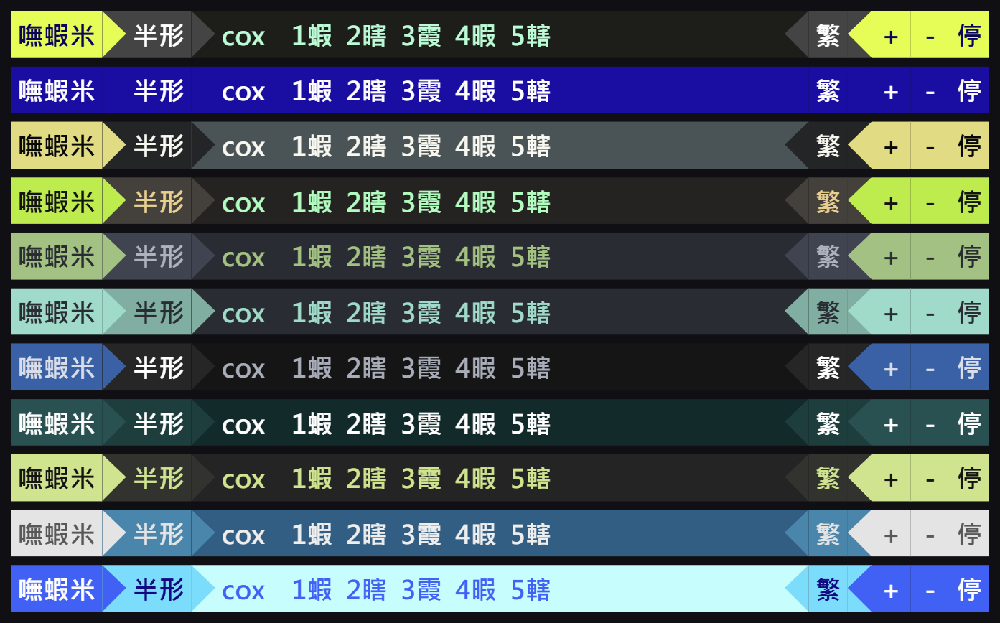

# EatShiamy 吃蝦米 😋

免安裝、不需管理員權限的第三方**嘸蝦米輸入法**（Windows only）。

到 [Releases](https://github.com/0100Light/eat-shiamy-releases/releases/latest)
下載 `EatShiamy-x.y.z.zip`。

（GitHub 會在每個 release 底下自動附一個 `Source code (zip)`，
那是它自己加的、內容是空的，不要下載那一個。）

## 畫面

多種主題，在狀態列上按右鍵就能換。

## 安裝

1. 下載 `EatShiamy-x.y.z.zip`
2. 解壓縮到任何你有寫入權限的資料夾（**不要放在 `C:\Program Files\` 底下**）
3. 執行裡面的 `EatShiamy.exe`

整個資料夾就是程式本身，搬到哪裡都能跑，也可以放隨身碟。
要移除就把資料夾刪掉，不會在系統裡留下任何東西 ——
它不寫登錄檔、不裝服務、不需要管理員權限。

**用法、設定、自動更新、疑難排解都寫在資料夾裡的 `manual.html`。**

### 第一次執行會被 Windows 攔下來

因為這支程式沒有數位簽章（那需要付費憑證）。

- **SmartScreen**「Windows 已保護您的電腦」→ 點「**其他資訊**」→「**仍要執行**」
- **Smart App Control**（Windows 11 全新安裝預設開啟）會直接擋掉而且沒有放行選項。
  只能先把它關掉，或改用其他輸入法。

另外第一次啟動會慢十幾秒，那是 Windows Defender 在掃描資料夾裡的幾百個檔案，
掃過一次就不會再慢。

## 運作方式

外掛式的輸入法：攔截按鍵、在自己的緩衝區組字，再把選定的字合成輸入到前景視窗，
候選字顯示在一條置頂的狀態列上。這條路線不必註冊到系統，所以免安裝、
不需要管理員權限，刪掉資料夾就移除乾淨。

它跟系統內建的輸入法各自獨立，切換方式也不一樣（預設單按 Shift）。

## 致敬

- **偽．蝦米 XLiu**（Luke Chang，2008）—— 攔鍵與送字照它走。它示範了不必做成
  TSF 輸入法、不必碰鍵盤配置，光靠逐鍵向系統註冊要攔哪些鍵、加上合成輸入送字，
  就做得出一支免安裝、不需要管理員權限的嘸蝦米。
- **倚天中文輸入法（Python 復刻版）**（張書維）—— UI 的原型。用 Tkinter 畫一條
  置頂狀態列當候選字視窗、UI 跑在自己的執行緒上、跟核心之間用 queue 單向通訊，
  這套結構沿用至今。

## 授權與來源

程式本身是原創，但它用到幾份別人的東西，在此致謝並標明歸屬：

| 來源 | 用途 | 授權 |
|---|---|---|
| [RIME 蝦米方案](https://github.com/RIME/rime-liu)（liur） | 字根表 `liur_Trad.dict.yaml` 等 | 第三方重製碼表，見下 |
| [OpenCC](https://github.com/BYVoid/OpenCC) | 繁簡對照表 `ts_map.json`（衍生自 `TSCharacters.txt`） | Apache-2.0 |
| [vim-airline](https://github.com/vim-airline/vim-airline-themes) | 狀態列的配色 | MIT |

**嘸蝦米輸入法本身是行易有限公司的商標與產品。** 這支程式與行易公司無關，
也不是官方版本。隨附的字根表是網路上早已公開流通的第三方重製版本，
不是官方的 `liu-uni.tab`。如果你需要官方版本、官方碼表或商業支援，
請洽 [行易嘸蝦米](https://www.liu.com.tw/)。
